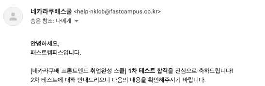

교육 프로그램을 알아보던 중 패스트 캠퍼스에서 네카라쿠배 프론트엔드스쿨 2기를 신청받는 것을 알았다. 1기 신청을 받을 때 한 번 신청해볼까 생각했었는데 너무 늦게 알아버려서 지원서를 작성할 시간이 없어 아쉬웠는데, 생각보다 다음 기회가 빨리와서 바로 신청했다.
 
 

## 1. 지원

네카라쿠배 프론트엔드스쿨 2기는 자기소개서를 작성해서 제출하고 구글폼을 통해 지원하는 식으로 진행되었다. 자기소개서 문항이 많은편이었고, 글자수 제한은 없어서 나는 1000자 내외로 맞춰 작성했다. 근데 나만 그런지 모르겠지만 글자수 제한이 없으니 어느정도로 작성해야할지 더 어려운듯... 여튼 지원서를 제출하고 바로 확인 메일이왔고, 테스트를 위한 준비에 들어갔다.
 
 
 

## 2. 1차 테스트

이 교육은 다른 교육과는 다르게 코딩테스트가 아닌 제공한 강의 내용을 객관식 문제로 테스트하는 방식이었다. 1차 테스트를 본지 조금 지나서 기억은 잘 안나는데 30문제 정도 되었던 것 같다. 나는 강의를 들으며 공부하는 식으로 테스트를 준비했다. 테스트를위해 제공해준 강의가 이전에 프론트엔드를 공부하기위해 개인적으로 들었던 강의여서 훨씬 수월하게 들을수 있었고, 당시에 정리하며 공부했던 것이 도움이 되어 정리 노트를 보고 열심히 공부할 수 있었다.

그리고 드디어 노력의 결실 🍒

1차 테스트에 합격했다! :)
 
 
 

## 3. 2차 테스트

바로 2차테스트 준비에 들어갔다. 2차도 1차와 마찬가지로 강의를 제공해주고 주관식 및 객관식 문제로 테스트하는 방식이었다. 다만, 1차는 하루동안 객관식 30문제를 풀었다면, 2차는 2주동안 매일(토/일 제외) 5문제씩 풀었다. 마지막 날에는 10문제인가. 여튼, 테스트를 2주동안 매일 봐야했기 때문에 하루하루 꾸준히 공부해야했고, 마지막 날에는 전범위로 테스트를 보기 때문에 강의를 듣고 노트에 정리하며 준비했다. 파이썬 강의였는데 야매로 조금 독학해본적이 있지만 제대로 강의를 들으며 차근차근 공부하는게 처음이라 이것저것 많이 배울 수 있어서 좋았다. 😁

그리고 마찬가지로 꾸준함의 결실 🍊

2차 테스트도 당당히 통과!  
그런데 사진에서도 보이듯이 담당자 분이 숨은참조로 바꾸는 것을 잊으신것 같다.  
아니면 일부러 몇배수인지 우리에게 알려주고 열심히 준비하도록 도모한 것인지...
 
 
 

## 4. 최종 면접

최종 면접은 결과가 나오고 바로 다음날...OMG 😐 면접을 준비할 시간이 너무 부족했다.  
다행이었던건 그나마 1기의 정보가 조금이라도 있었다는 것이다. 1기 선배(?)들은 면접을 어떻게 준비했는지 찾아보다가 발견한건 [네카라쿠배 교육과정 공식 블로그](https://blog.naver.com/fastcampus_nklcb)였다. 정말 도움이 많이 됐던건 [인성/기술 면접 예상 질문](https://blog.naver.com/PostList.nhn?blogId=fastcampus_nklcb&from=postList&categoryNo=6)에 대해 다룬 글이었다. 공식 블로그에 올린 글이니 당연히 여기에서 나오지 않을까 생각했고, 예상이 적중한건 아니었지만 예상 질문과 비슷한 맥락의 질문들이 많이 나와서 답을 정리해보며 준비한 것이 많이 도움이 되었다. 면접과 관련해서는 자세히 어떤 질문들을 받았다고 기술하기는 어렵고, 혹시 이 부분에 대해 도움이나 조언이 필요하시다면 아래 코멘트 달아주시길!(언제까지나 제 경험을 바탕으로 말씀드려요)

그리고 면접 당일, 나는 배민 현직자B 분에게 면접을 보았고 면접 분위기 자체는 엄청 편안했다. 2차 테스트 후에 구글폼을 통해서 네카라쿠배 중 가고싶은 회사를 선택하는 질문이 있는데 답에 따라 면접관이 바뀌는듯했다.(개인적인 추측) 나는 배달의 민족(우아한 형제들)을 선택했었고. 여튼 그렇게 면접이 시작됐고, 면접은 20분 동안 이루어졌으며 처음엔 엄청 긴장했지만 뒤로 갈수록 긴장이 풀렸다. 질문에 잘 대답했다고 물으면 글쎄... 명확히 말하기 어려운데 모든 질문에 대해서 평균정도는 되지 않았을까 추측해본다.

제일 긴장됐던 면접까지 마치고 🍉

짠! 최종 합격 메일을 받았다.  
오후 5시가 되기 전에 통화로 먼저 최종 합격 연락을 주었고, 메일은 저녁 7시쯤 받았다.
 
 
 

## 5. 앞으로?

약 한달간의 긴 선발과정을 거치고 최종 20명에 합격했다는 것에 무척 기분이 좋았다.  
그리고 동시에 정말 열심히 해야겠다 다짐했다. 이제 당장 다음주부터 교육 시작인데 함께 교육받을 동료들이 기대되고 기다려진다. 교육 기간동안 어떤일이 펼쳐질지, 이 교육으로인해 내가 얼만큼 성장할지 아직 아무것도 모르지만 열정과 패기로 도즈언-! 👊🏻
