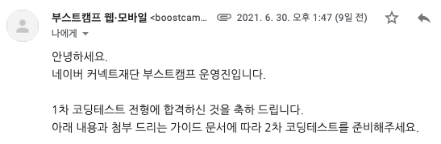

부스트캠프 5기를 패기롭게 도전하고 광탈한뒤 😅 1년이 지난 지금 다시 6기에 도전했다.  
1차, 2차 코딩테스트를 보고 아직 결과를 기다리고 있는 중이라 합불은 모르지만...  
또 다시 1, 2차 코딩테스트에 대한 나의 발걸음을 기록하려한다.
 
 

## 1. 지원

패스트캠퍼스의 네카라쿠배 프론트엔드 스쿨 2기를 한참 준비하고 있을 때 연락이 왔다. 부스트캠퍼스 2021이 접수받고있다고. 5기 때의 광탈했던 슬픈 기억을 뒤로하고 다시 자기소개서부터 적어내려갔다. 5기를 신청했을때보다 프론트엔드를 공부하고 프로젝트 경험도 있어서 자소서의 질이 좀 더 높아졌을거라 생각한다. 전체적으로 문항은 많은편이었는데 글자수 제한은 적은편이어서 금방 적을 수 있었다. 무엇보다 글자수 제한이 적어 내가 전하고자하는 포인트를 잘 뽑아내는 과정에서 시간이 많이 들었다. 포트폴리오도 노션을 사용해서 어느정도 정리한 후 함께 제출했고, 제출 후에 바로 접수 완료 메일을 받았다.
 
 
 

## 3. 1차 코딩 테스트

부스트캠프 5기 때와 달리 코딩테스트 응시료가 있었다. 1차 합격여부와 상관없이 응시료는 최초 한 번, 1만원을 납부했다. 부스트캠프에 선발되어 교육 받을 수 있다면 1만원이야... 게다가 코딩테스트는 많이 경험해볼수록 좋기때문에 큰 고민없이 입금후 1차 코딩테스트를 준비했다. 테스트 전날 안내 메일이 오고, 테스트 당일. 문제는 객관식 문제 10개, 알고리즘 문제 2개를 100분동안 풀어야했다.
 
 

### 객관식 문제

객관식 문제들은 전체적으로 다양한 범위에서 출제되었다. 규정상 문제에 대해 자세히 언급할수는 없지만, 대학교에서 C언어를 배우고 처음으로 퀴즈를 풀었을때의 쉬운 난이도부터 전공 수업 컴퓨터구조와 운영체제, 알고리즘과 같은 기본 CS 지식의 얕은부분을 물어보는 정도의 난이도였다. 10문제 다 풀기는했지만 다 맞았을지는 잘 모르겠다.

### 문제 1.

몇일됐다고... 기억이 안난다. 처음 알고리즘 문제를 보고 조금 당황했던것만 기억난다. 작년 코딩테스트와는 조금 다른 결의 문제였고, 어려운 난이도는 아니었지만 어느정도 알고리즘 지식을 요구하는 문제였다. 푸는데 시간이 그렇게 오래걸리진 않았고, 테스트 케이스는 모두 맞췄다.

### 문제 2.

조금 생각이 필요했던 문제였다. 효율적으로 푸는 방법을 생각하다가 떠올랐고 그대로 구현했다. 조금 아쉬웠던 부분은 테스트 케이스 8개중 7개를 맞췄다는 것. 내가 놓친 부분이 있다는 것인데 남은시간동안 계속 고민했지만 결국 해결하지못하고 끝나버렸다.

- 각 자료타입에 대한 크기를 맵에 저장해두고, 반복문을 돌면서 각 자료타입을 8byte에 할당하는 식으로 풀었다. (16byte의 경우 예외)
- 시간 복잡도는 주어진 입력 데이터 n개를 기준으로 O(n)이었다.
   
   

그리고 1차 코딩 테스트 결과 🍇

조금 불안했는데 합격했다 ㅎㅎ
 
 
 

## 4. 2차 코딩 테스트

알고리즘 3문제를 160분동안 풀어야했다. 전체적인 난이도는 쉬운편이었다. 오히려 1차보다? 다만, 구현문제이고 예외처리가 많아서 시간이 많이 필요했다. 덕분에 문제는 모두 풀었지만 코드를 정리할 시간도 없었고, 겨우 시간내에 문제에서 요구하는것을 전부 만족한 정도.  
(제 기준에서 제 생각입니다. 올솔인지는 미지수)

### 문제 1.

그냥 구현하면 되는 문제였다. 다만, 문제상에 예외처리해야하는 부분이 명시되어있어서 문제를 대충 읽었거나 빠르게 넘겼다면 보지 못했을 수도 있을 것 같다. 빠르게 풀고 다음 문제로 넘어갔다.

- 문제에서 요구하는대로 입력 데이터를 보드에 하나씩 맞춰보고 예외가 있으면 바로 리턴, 아니라면 마지막에 보드를 전부 돌면서 한번더 확인하는 식으로 풀었다.
- 시간 복잡도는 주어진 입력 데이터 n개 와 mxm 보드를 기준으로 O(n) + O($$n^2$$) 였다.

### 문제 2.

문제 내에서 함수를 분리하고, 기존언어에서 제공하는 내장 함수를 사용하지말고 자신이 구현하라고 했는데, 일단 처음에는 내장함수를 사용해서 구현해 테스트 케이스가 맞는지 확인했다. 그 후에 해당 내장함수를 직접 구현하는 식으로 진행했는데, 이 부분에서 디버깅하는데 시간을 너무 많이 썼다. 예외 처리해야하는 부분도 있어서 이부분도 신경썼다.

- 문제에서 요구하는 순서 그대로 구현하고, 직접 구현해야하는 함수는 따로 빼서 풀었다.
- 시간 복잡도는 주어진 입력 데이터 n개를 기준으로 O(n)이었다.

### 문제 3.

문제 2번과 마찬가지로 함수를 분리시키라는 요구사항이 있어서 처음에 한 함수에 그대로 구현하고 후에 따로 클래스를 사용하여 빼주었다. 예외처리해야하는게 워낙 많아서 이 부분도 따로 함수로 빼주어 구현했다. 구현하는 것 자체는 쉬워서 비전공자분들도 어려움 없었을것으로 생각된다. 시간이 5분남았을 때 테스트 케이스 1개가 틀려서 완전 맨붕이었는데 정신 똑바로 차리고 잘못된 부분을 바로 찾아내어 고쳐 제출하였다. 손이 덜덜 떠렸던...

- 문제에서 요구하는 명령어들을 처리하는 함수들을 갖는 클래스로 따로 빼서 구현했다.
- 시간 복잡도는 주어진 입력 데이터 n개를 기준으로 O(n).
   
   
   

## 5. 느낀점

5기에서 광탈한 후 재도전인데, 2차 테스트까지 경험할 수 있어서 정말 좋았다. 부스트캠프 6기를 준비하는 오픈카톡방이 있어서 들어갔는데, 역시 문제 난이도가 어려운 편이 아니었는지 대부분 올솔했다더라... 물론 예외처리를 잘 하고 히든 케이스까지 완벽하게 구현했는지는 모르겠지만...! 다들 열심히 준비한만큼 좋은 결과있어서 함께 교육받게되면 너무 좋을 것 같다:)  
결과는 7월 13일 화요일 예정인데, 결과 나오는대로 추가해서 작성하겠다.
