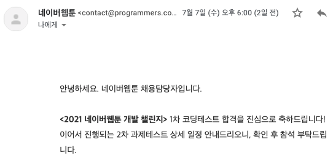

프로그래머스에서 알고리즘을 공부하다가, 우연히 네이버웹툰 개발 챌린지 공고를 보았다. Front-End 포지션도 있어서 코딩테스트는 많이 경험할수록 좋다는 생각에 바로 지원했다.
 
 

## 1. 지원

지원은 5분만에 끝이 났다. 자기소개서를 작성하는 것도 아니었고, 프로그래머스에서 간단한 프로필을 작성하는 정도로 바로 지원이 가능했다. 1, 2차 코딩 테스트 후에 제대로 지원서를 받고 또 다시 1, 2차 면접을 보는 식으로 진행되어서 상당히 어려운 과정들을 통과해야 했기 때문에 조금 가볍게 경험만 해보자는 생각으로 지원했다.
 
 
 

## 2. 1차 코딩 테스트

테스트는 총 3문제, 120분동안 이루어졌다.  
솔직히 기존 네이버 코딩테스트의 난이도를 생각하면 쉬운편이라고 생각했다.  
물론 그렇다고 내가 잘 푼것은 아니지만...
 
 

### 문제 1.

처음에 접근을 잘못해서 recursive로 생각했다가 잘못된 것을 깨닫고 빠르게 알고리즘을 바꿨다. 잘못된 생각을 너무 오래잡고 있어서 시간을 허비했는데 그래도 새로운 알고리즘을 빠르게 풀 수 있어서 다행... 디버깅 하는데 시간이 좀 더 걸렸다.  
그리디로 풀었고 입력 데이터 n개를 도는정도 O(n)으로 풀었다.

### 문제 2.

분명 이전에 봤던 문제이고, 그때도 못풀었던 문제인데... 이번에도 또 못풀었다. 이건 처음부터 접근을 잘못했더라ㅎㅎ 알고리즘 공부가 더 필요함을 절실하게 느끼게해준 문제. 테스트가 끝나고 조금 찾아봤는데 투포인터를 활용하면 되는 문제였고 투포인터를 떠올리자마자 해결방법이 바로 생각나서 조금 허무했다.

### 문제 3.

2번 문제를 생각하느라 20분을 남겨두고 문제를 처음 봤다. 거의 망했다 생각하고 문제를 봤는데 이전에 비슷한 문제를 풀어본 적이 있어서 진짜 빠르게 풀 수 있었다. 구현 문제라서 코드양도 상당히 많이 필요했는데 15분만에 클리어... 효율성 생각을 할 수도 없는 시간이라 brute force로 구현했다.
 
 

그리고 1차 코딩 테스트 결과 🍇

솔직히 망했다고 생각했는데 이번 1차 컷을 조금 낮게 잡은듯하다.
 
 
 

<!-- ## 3. 2차 코딩 테스트

알고리즘 3문제를 160분동안 풀어야했다. 전체적인 난이도는 쉬운편이었다. 오히려 1차보다? 다만, 구현문제이고 예외처리가 많아서 시간이 많이 필요했다. 덕분에 문제는 모두 풀었지만 코드를 정리할 시간도 없었고, 겨우 시간내에 문제에서 요구하는것을 전부 만족한 정도.
(제 기준에서 제 생각입니다. 올솔인지는 미지수)

### 문제 1.

그냥 구현하면 되는 문제였다. 다만, 문제상에 예외처리해야하는 부분이 명시되어있어서 문제를 대충 읽었거나 빠르게 넘겼다면 보지 못했을 수도 있을 것 같다. 빠르게 풀고 다음 문제로 넘어갔다.

- 문제에서 요구하는대로 입력 데이터를 보드에 하나씩 맞춰보고 예외가 있으면 바로 리턴, 아니라면 마지막에 보드를 전부 돌면서 한번더 확인하는 식으로 풀었다.
- 시간 복잡도는 주어진 입력 데이터 n개 와 mxm 보드를 기준으로 O(n) + O($$n^2$$) 였다.

### 문제 2.

문제 내에서 함수를 분리하고, 기존언어에서 제공하는 내장 함수를 사용하지말고 자신이 구현하라고 했는데, 일단 처음에는 내장함수를 사용해서 구현해 테스트 케이스가 맞는지 확인했다. 그 후에 해당 내장함수를 직접 구현하는 식으로 진행했는데, 이 부분에서 디버깅하는데 시간을 너무 많이 썼다. 예외 처리해야하는 부분도 있어서 이부분도 신경썼다.

- 문제에서 요구하는 순서 그대로 구현하고, 직접 구현해야하는 함수는 따로 빼서 풀었다.
- 시간 복잡도는 주어진 입력 데이터 n개를 기준으로 O(n)이었다.

### 문제 3.

문제 2번과 마찬가지로 함수를 분리시키라는 요구사항이 있어서 처음에 한 함수에 그대로 구현하고 후에 따로 클래스를 사용하여 빼주었다. 예외처리해야하는게 워낙 많아서 이 부분도 따로 함수로 빼주어 구현했다. 구현하는 것 자체는 쉬워서 비전공자분들도 어려움 없었을것으로 생각된다. 시간이 5분남았을 때 테스트 케이스 1개가 틀려서 완전 맨붕이었는데 정신 똑바로 차리고 잘못된 부분을 바로 찾아내어 고쳐 제출하였다. 손이 덜덜 떠렸던...

- 문제에서 요구하는 명령어들을 처리하는 함수들을 갖는 클래스로 따로 빼서 구현했다.
- 시간 복잡도는 주어진 입력 데이터 n개를 기준으로 O(n).
   
   
    -->

## 4. 느낀점

가벼운 마음으로 경험만하자고 생각하고 시작했는데, 1차 테스트가 붙고나서 조금 욕심이 생기는건 정말 어쩔수 없나보다. 2차 테스트는 과제 해결방식, 진짜 걱정되는 부분이라 솔직히 망할 것 같긴하지만ㅋㅋㅋ 나름 짧은 기간내에 열심히 준비해서 치뤄보려한다. 2차 테스트 후에 결과와 함께 추가 작성해야겠다.
