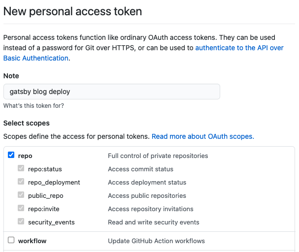
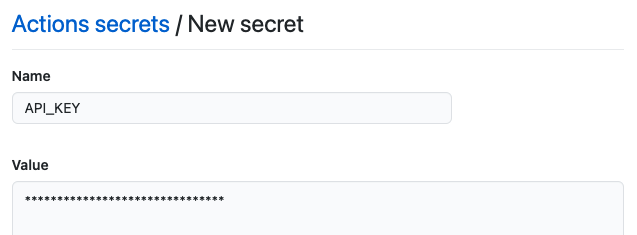
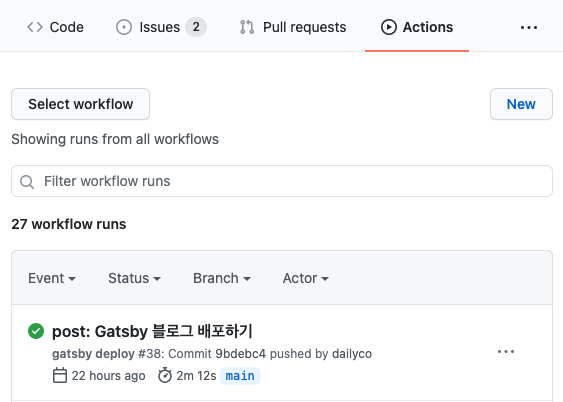

우리는 블로그에 포스팅할 때마다 새롭게 build하고 deploy 해주어야한다.  
이 과정은 여간 번거로운게 아닌데, github actions을 사용하면 이 과정을 자동화시킬 수 있다.
<br />
<br />

## Github Actions 로 배포 자동화하기

Github Actions를 사용하기 위해서는 먼저 해당 레포지토리에 접근할 수 있게 해주는 Token을 생성해야한다.

### Github Actions 토큰 생성

레포지토리가 아닌 자신의 Github [`Settings > Developer settings > Personal access tokens`](https://github.com/settings/tokens) 로 가서 `Generate New Token` 버튼을 클릭해 아래와 같이 Note 에 토큰 이름을 적고, Select scopes는 Repo 부분을 전부 체크해준다. 배포 자동화는 Repo 부분의 액션들로 충분히 가능하다.



`Generate token` 버튼을 누르면 토큰이 생성되는데, 토큰은 다음에 다시 확인할 수 없기 때문에 꼭 복사해서 어딘가에 기록해두어야한다.

### Token 할당

위에서 생성한 토큰을 레포지토리에 할당한다. 레포지토리의 `Setting > Secrets` 로 가서 `New repository secret` 버튼을 클릭해 아래와 같이 Name에는 원하는 토큰 이름을, Value에는 생성한 토큰 값을 넣어주고 `Add secret` 버튼을 클릭해 생성해주면 끝이다.



### Work Flow 생성

레포지토리의 `Actions` 메뉴로 가면 아래와 같이 초기 화면이 보일텐데 <u>setup a workflow yourself →</u> 를 클릭해 main.yml을 생성할 수 있도록 한다. 만약 이미 다른 Actions이 생성되어 있다면 오른쪽 상단의 `New workflow` 버튼을 클릭하면된다.

main.yml 파일은 어떠한 상황에 어떤 행동을 할 것인지 flow를 정의해주는 파일이며 아래와 같이 작성해주면 된다.

```yaml
name: gatsby deploy

on:
  push:
    branches: [main]

jobs:
  deploy:
    name: deploy
    runs-on: ubuntu-latest

    steps:
      - name: checkout code
        uses: actions/checkout@v2

      - name: packages install
        run: yarn install

      - name: gatsby build
        run: yarn build
        env:
          // API_KEY 에는 자신이 secret을 생성할 때 설정한 이름으로 넣어야 한다
          GH_API_KEY: ${{ secrets.API_KEY }}

      - name: deploy
        uses: maxheld83/ghpages@v0.2.1
        env:
          GITHUB_TOKEN: ${{ secrets.GITHUB_TOKEN }}
          // API_KEY 에는 자신이 secret을 생성할 때 설정한 이름으로 넣어야 한다
          GH_PAT: ${{ secrets.API_KEY }}
          BUILD_DIR: 'public/'
```

간단하게 파일을 설명하면 아래와 같다.  
아래 설명은 이해하기 쉽게 설명한 것이기 때문에 정확하지 않을수 있다.

- `name: gatsby deploy` : gatsby 블로그 배포 과정을 자동화 하는 것이기 때문에 해당 actions의 이름을 gatsby deploy라 명명
- `on: push: branches: [main]` : main 브랜치에 push를 할때마다 아래 jobs를 실행
- `jobs: deploy: name: deploy` : 일련의 jobs flow 를 정의하는데 해당 jobs의 이름을 deploy로 명명
- `runs-on: ubuntu-latest` : 실행 환경을 ubuntu-latest로 설정
- `steps:` : 일련의 실행 jobs를 아래에 적어내림, 순서대로 actions이 실행
- `name:` : 실행시키려는 job의 이름 설정
- `uses:` : 이미 만들어진 액션을 사용, 위의 경우 이미 만들어져있는 코드를 checkout 하는 액션을 사용하는 것, `@v2` 는 버전을 나타냄
- `run:` : 실행시킬 명령어 (cmd)
- `env:` : 환경 변수, 위에서 `secrets.API_KEY` 부분은 우리가 이전에 생성한 secret 값을 가져와 할당해주는 것

간략하게 설명했으니 혹시 github actions을 다르게 구현하고싶다면 원하는대로 수정해서 작성하길 바란다.

### Push 해서 동작 확인

main.yml 파일을 생성하면 기본적으로 `.github/workflow/` 디렉토리에 위치한다. 파일을 확인하고 main 브랜치에 push하면 `Actions` 탭에서 우리가 설정한 action이 실행되고, 실행이 완료되면 아래와 같이 실행 완료됐음을 확인할 수 있다.



<br />
<br />
<br />

## Github 도메인 초기화 문제 해결하기

Github Actions를 사용해서 배포 과정을 자동화 시킨 것은 정말 편리한데, 한 가지 문제가 있었다. [이전 포스팅](https://dailyco.tech/share/gatsby-blog-domain/)처럼 도메인을 구매해 custom domain을 연결했을 경우 블로그가 배포될 때마다 연결한 도메인이 초기화 되는 것이 아닌가. 이 문제는 CNAME 파일을 복사해서 배포해줌으로 해결할 수 있다.

### CNAME 파일

기본적으로 CNAME 파일은 custom domain을 연결해주면 root 디렉토리 아래에 자동으로 생성된다. 로컬에서 이를 확인하기 위해서는 pull 을 해야할 것이다.

여러가지 검색해본 결과, 이 CNAME 파일은 Custom domain 이 존재할 때 도메인 값을 저장하고있는 파일이다. 간단히 말하면, 깃헙에서 root 디렉토리 아래에 CNAME 파일이 존재하면, 이 파일을 읽고 그 값을 Custom domain으로 설정하는 식으로 작동하는 것이다. (나의 추측이다)

이 CNAME 파일은 main 브랜치에 root 디렉토리 아래에 존재한다. 하지만 정작 배포될 때는 build 할 때 생성되는 public 디렉토리 아래의 파일들을 기준으로 배포한다. 그래서 CNAME 파일이 없어진채로 배포가 되고, CNAME 파일이 없으니 깃헙에서는 Custom domain이 없다고 생각해 기존 \${github-id}/github.io/\${repository-name} 으로 도메인을 초기화하여 문제가 된다. 이 문제를 해결하기 위해서 CNAME 파일을 build 후에 public 디렉토리 아래로 복사시켜주는 과정이 필요하다.

### main.yml 파일 수정하기

Github Actions에서 CNAME 파일을 복사시켜주는 과정을 추가하기 main.yml 파일을 아래와같이 수정해야한다.

```yaml
name: gatsby deploy

on:
  push:
    branches: [main]

jobs:
  deploy:
    name: deploy
    runs-on: ubuntu-latest

    steps:
      - name: checkout code
        uses: actions/checkout@v2

      - name: packages install
        run: yarn install

      - name: gatsby build
        run: yarn build
        env:
          GH_API_KEY: ${{ secrets.API_KEY }}

	  - name: CNAME copy
        run: cp CNAME public/

      - name: deploy
        uses: maxheld83/ghpages@v0.2.1
        env:
          GITHUB_TOKEN: ${{ secrets.GITHUB_TOKEN }}
          GH_PAT: ${{ secrets.API_KEY }}
          BUILD_DIR: 'public/'
```

build와 deploy 과정 사이에 CNAME 파일을 `public` 디렉토리에 복사하는 명령을 추가한 것이다. 이렇게하면 `public` 디렉토리 아래에 CNAME 파일이 복사되어 함께 배포되기 문제가 해결된다.

### deploy script 수정

Github Actions만을 사용해 배포할 경우 `main.yml` 파일만 수정하면 되지만, 로컬에서 `npm run deploy` 명령을 통해 배포를 하는 사람도 있을 것이다. 이 경우에도 마찬가지로 커스텀 도메인이 초기화되는 문제가 발생할 수 있는데, 이는 deploy script를 수정해 해결할 수 있다.

```sh
"scripts": {
	"copy": "cp CNAME public/"
	"deploy": "gatsby build && npm run copy && gh-pages -d public -b gh-pages"
}
```

`package.json` 파일의 script 부분을 위처럼 copy를 추가하고, deploy를 수정하면 된다. Github Actions과 마찬가지로 build하고 deploy하기 전에 CNAME 파일을 `public` 디렉토리 아래에 복사하도록 한것이다.
