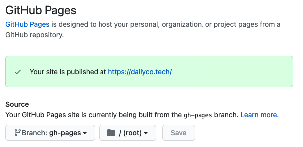

Gatsby 블로그는 두가지 방법으로 배포가 가능하다. netlify로 배포하는 방법과 github pages로 배포하는 방법이 있는데, 두 가지 방법 모두 간단하기 때문에 자신이 원하는 방법을 선택하면 될 것 같다. 나는 굳이 netlify를 사용하는 것보다 github으로 배포와 코드 관리 모두 이루어지면 더 편할것 같아 github pages로 배포하기로 결정했다.
<br />
<br />

## 1. Github pages로 배포하기

github pages로 블로그를 배포하기 위해서는 배포를 위한 정적 파일들을 관리해줄 브랜치를 새로 생성해야한다.

### gh-pages 브랜치 생성

```sh
cd ${디렉토리 이름}
git branch gh-pages
git push origin gh-pages
```

이렇게하면 gh-pages 브랜치가 생성되고, 이 브랜치는 정적 배포 파일들을 관리할 것이다.

### gh-pages 라이브러리 설치

github pages로 배포를 위해서는 gh-pages 라이브러리를 사용한다.  
아래 명령어로 라이브러리를 설치할 수 있다.

```sh
# yarn 사용
yarn add gh-pages
```

```sh
# npm 사용
npm i gh-pages --save-dev
```

<br />

### deploy script 작성

다음으로 이제 package.json 파일에 deploy script를 추가하고, 실제로 deploy 시켜보자.
`package.json` 파일에 아래 코드를 추가한다.

```json
"scripts": {
    "deploy": "gatsby build && gh-pages -d public -b gh-pages"
}
```

간단하게 코드를 살펴보면 `gatsby build` 명령으로 파일을 build해서 배포할 정적파일들을 생성하고, `gh-pages` 명령으로 배포를 해주는 것인데 여기에 `-d public` 옵션은 배포할 파일은 public 디렉토리 아래에 있는 파일들이라는 것이다. 마지막으로 `-b gh-pages` 옵션은 배포할 브랜치를 설정해준 것으로 gh-pages 브랜치에 정적 파일들을 배포시켜준다.

스크립트 작성은 끝났고, 아래와 같이 명령어를 입력하면 배포가 이루어진다.

```sh
npm run deploy
```

해당 명령어 실행 후 마지막 줄에 `Published` 라고 메세지가 떴다면 배포는 잘 된 것이다.
<br />
<br />

### GitHub Pages 설정

gh-pages 브랜치에 build된 정적파일들이 배포는 되었는데, github은 배포된 브랜치가 gh-pages라는 것을 아직 모른다. github 에서 배포한 페이지를 제대로 작동하게하기 위해서는 배포한 정적파일들의 Source 코드가 gh-pages 브랜치에 있다고 알려주어야한다.

자신의 레포지토리에서 `Settings > Pages` 로 이동해서 Source의 브랜치를 아래와 같이 브랜치를 설정하고 Save 해주면 된다.

<br />
<br />

### 배포된 페이지 확인

github pages의 Source까지 모두 설정시켜주면 배포는 끝이난다.

주의해야할 부분은, 레포지토리의 이름을 `${github-id}.github.io`로 했다면 "\${github-id}.github.io"에서 배포된 사이트를 확인할 수 있다.

하지만 레포지토리의 이름을 원하는대로 다르게 했다면 "\${github-id}.github.io/\${repository-name}"에서 배포된 사이트를 확인 가능하다.
