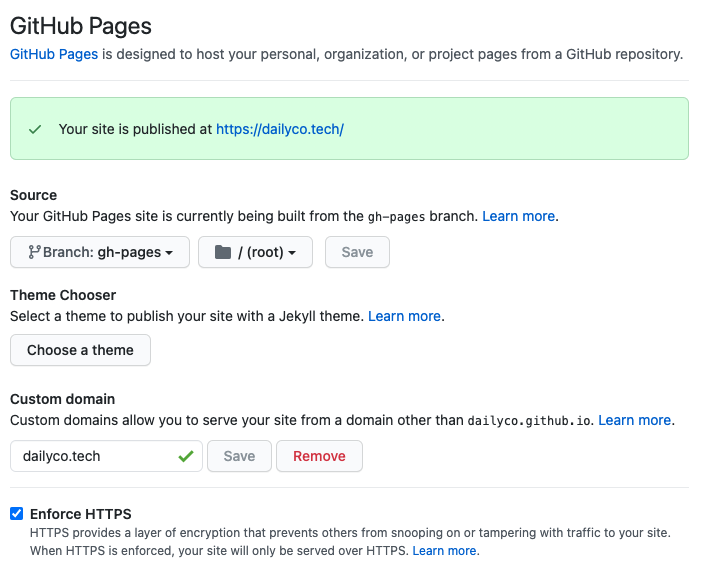
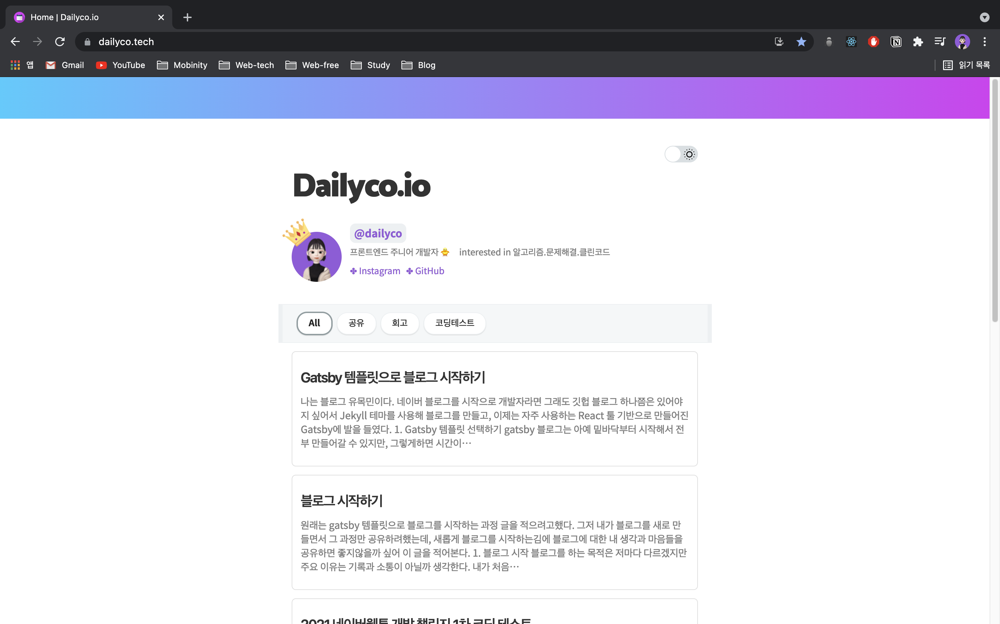

Gatsby 블로그는 두가지 방법으로 배포가 가능하다. netlify로 배포하는 방법과 github pages로 배포하는 방법이 있는데, 두 가지 방법 모두 간단하기 때문에 자신이 원하는 방법을 선택하면 될 것 같다. 나는 굳이 netlify를 사용하는 것보다 github으로 배포와 코드 관리 모두 이루어지면 더 편할것 같아 github pages로 배포하기로 결정했다.

## 1. Github pages로 배포하기

github pages로 블로그를 배포하기 위해서는 배포를 위한 정적 파일들을 관리해줄 브랜치를 새로 생성해야한다.

### gh-pages 브랜치 생성

```sh
cd ${디렉토리 이름}
git branch gh-pages
git push origin gh-pages
```

이렇게하면 gh-pages 브랜치가 생성되고, 이 브랜치는 정적 배포 파일들을 관리할 것이다.

### gh-pages 라이브러리 설치

github pages로 배포를 위해서는 gh-pages 라이브러리를 사용한다.  
아래 명령어로 라이브러리를 설치할 수 있다.

```sh
# yarn 사용
yarn add gh-pages
```

```sh
# npm 사용
npm i gh-pages --save-dev
```

### deploy script 작성

다음으로 이제 package.json 파일에 deploy script를 추가하고, 실제로 deploy 시켜보자.
`package.json` 파일에 아래 코드를 추가한다.

```json
"scripts": {
    "deploy": "gatsby build && gh-pages -d public -b gh-pages"
}
```

간단하게 코드를 살펴보면 `gatsby build` 명령으로 파일을 build해서 배포할 정적파일들을 생성하고, `gh-pages` 명령으로 배포를 해주는 것인데 여기에 `-d public` 옵션은 배포할 파일은 public 디렉토리 아래에 있는 파일들이라는 것이다. 마지막으로 `-b gh-pages` 옵션은 배포할 브랜치를 설정해준 것으로 gh-pages 브랜치에 정적 파일들을 배포시켜준다.

스크립트 작성은 끝났고, 아래와 같이 명령어를 입력하면 배포가 이루어진다.

```sh
npm run deploy
```

해당 명령어 실행 후 마지막 줄에 `Published` 라고 메세지가 떴다면 배포는 잘 된 것이다.

### GitHub Pages 설정

gh-pages 브랜치에 build된 정적파일들이 배포는 되었는데, github은 배포된 브랜치가 gh-pages라는 것을 아직 모른다. github 에서 배포한 페이지를 제대로 작동하게하기 위해서는 배포한 정적파일들의 Source 코드가 gh-pages 브랜치에 있다고 알려주어야한다.

자신의 레포지토리에서 `Settings > Pages` 로 이동해서 Source의 브랜치를 아래와 같이 브랜치를 설정하고 Save 해주면 된다.


### 배포된 페이지 확인

github pages의 Source까지 모두 설정시켜주면 배포는 끝이난다.

주의해야할 부분은, 레포지토리의 이름을 `${github-id}.github.io`로 했다면 "\${github-id}.github.io"에서 배포된 사이트를 확인할 수 있다.

하지만 레포지토리의 이름을 원하는대로 다르게 했다면 "\${github-id}.github.io/\${repository-name}"에서 배포된 사이트를 확인 가능하다.
<br />
<br />
<br />

## 2. 블로그 도메인 연결하기

배포는 끝났지만, 나와 같이 자신이 원하는 도메인을 직접 구매하여 적용하고싶은 사람이 있을 것 같아 이 부분도 함께 정리해본다.

### 도메인 구매하기

일단 자신이 원하는 도메인을 구매해야한다. 나는 `hosting.kr` 에서 구매했는데 내가 원하는 도메인의 가격이 가장 저렴했기 때문에 이곳에서 구매했다. 도메인의 가격은 판매사마다 다르기 때문에 여러곳을 찾아보는 것이 좋다. 물론 판매사가 망하지 않을 곳으로 고르는 것도 중요하지만, 도메인 회사가 망하더라도 도메인은 다른 회사에 흡수되어 관리되어지기 때문에 크게 걱정하지 않아도 된다. 아래는 내가 도메인을 구매하기위해 찾아보았던 사이트들이다.

- <https://www.hosting.kr/>
- <https://domain.whois.co.kr/>
- <https://www.namecheap.com/domains/>
- <https://www.yesnic.com/>
- <https://domain.gabia.com/>
- <https://www.dotname.co.kr/domain/new/search>

### DNS 설정

도메인을 구매했다면 DNS를 설정해야한다. 나는 hosting.kr을 통해 도메인을 구매했기 때문에 hosting.kr 기준으로 설명하겠지만, 다른 도메인 서비스도 비슷하게 설정가능할 것이다.

`나의 서비스 > 도메인 관리 > 나의 도메인 > DNS 설정` 메뉴로 이동하면 아래 부분에 `DNS 레코드 관리` 메뉴가 있는데 이곳에서 아래 '+' 버튼을 클릭해 DNS 레코드를 추가해준다. 만약 '+' 버튼이 비활성화 되어있다면 도메인이 잠금되어 있는것이니 풀어주고 DNS를 설정한 후 다시 잠그면 된다.

| 레코드 타입  | 서브도메인 | 값                      | 우선순위 |
| :----------: | :--------- | :---------------------- | :------- |
|   A Record   |            | 185.199.108.153         | 1        |
|   A Record   |            | 185.199.109.153         | 1        |
|   A Record   |            | 185.199.110.153         | 1        |
|   A Record   |            | 185.199.111.153         | 1        |
| CName Record | www        | \${github-id}.github.io | 2        |

위 표는 GitHub에서 명시하고있는 github pages 호스팅 IP 주소이다. A Record의 경우 4개중 한 개만 등록해도 무방하며, 나는 안전하게 2개정도를 등록했다. 아래와 같이 CName Record까지 모두 등록하면 DNS 설정은 끝이난다.


### Github Pages 설정

Source 브랜치를 설정했을 때와 마찬가지로 github pages에서 custom domain을 등록해준다. 레포지토리에서 `Settings > Pages` 로 이동해 아래와 같이 Custom domain에 자신이 구매한 도메인을 입력하고 Save 하면 github에서 제대로 등록되었는지 확인 후에 도메인이 연결된다.



추가로 github에서는 HTTPS 주소까지 제공해준다.  
하단에 Enforce HTTPS 의 체크박스를 체크해주면 HTTPS 주소가 사용가능하다.

### 배포된 페이지 확인

위 과정을 모두 마치면, 아래와 같이 우리가 구매한 도메인 사이트에서 블로그를 볼 수 있다.

