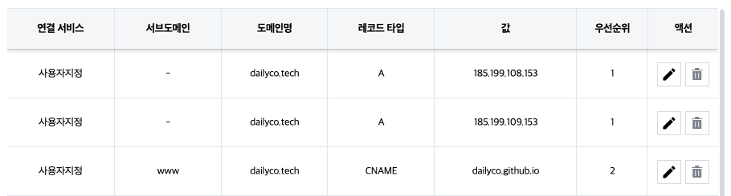
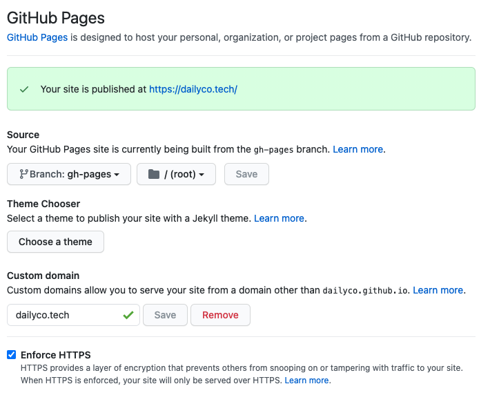
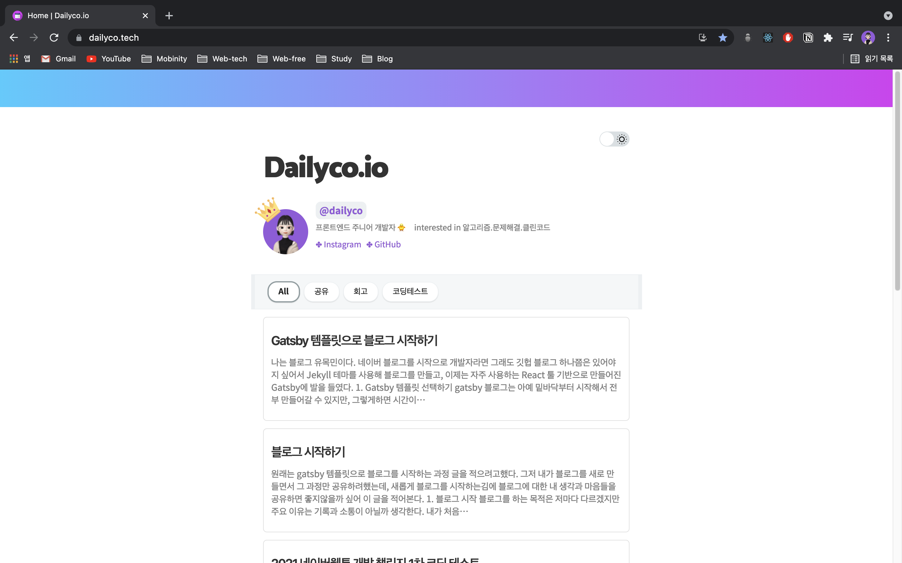

github pages로 배포하는 방법을 사용해서 블로그를 배포해보았다. 블로그를 배포한 후에 나는 개인적으로 도메인을 구매해 블로그에 연결하고 싶었기 때문에 방법을 열심히 찾아보았고, 내가 했던 삽질의 결과를 여기에 정리해 본다.
 
 

## 1. 도메인 구매하기

일단 자신이 원하는 도메인을 구매해야한다. 나는 `hosting.kr` 에서 구매했는데 내가 원하는 도메인의 가격이 가장 저렴했기 때문에 이곳에서 구매했다.

도메인의 가격은 판매사마다 다르기 때문에 여러곳을 찾아보는 것이 좋다. 물론 판매사가 망하지 않을 곳으로 고르는 것도 중요하지만, 도메인 회사가 망하더라도 도메인은 다른 회사에 흡수되어 관리되어지기 때문에 크게 걱정하지 않아도 된다.

아래는 내가 도메인을 구매하기위해 찾아보았던 사이트들이다.

- <https://www.hosting.kr/>
- <https://domain.whois.co.kr/>
- <https://www.namecheap.com/domains/>
- <https://www.yesnic.com/>
- <https://domain.gabia.com/>
- <https://www.dotname.co.kr/domain/new/search>
   
   
   

## 2. DNS 설정

도메인을 구매했다면 DNS를 설정해야한다. 나는 hosting.kr을 통해 도메인을 구매했기 때문에 hosting.kr 기준으로 설명하겠지만, 다른 도메인 서비스도 비슷하게 설정가능할 것이다.

`나의 서비스 > 도메인 관리 > 나의 도메인 > DNS 설정` 메뉴로 이동하면 아래 부분에 `DNS 레코드 관리` 메뉴가 있는데 이곳에서 아래 '+' 버튼을 클릭해 DNS 레코드를 추가해준다. 만약 '+' 버튼이 비활성화 되어있다면 도메인이 잠금되어 있는것이니 풀어주고 DNS를 설정한 후 다시 잠그면 된다.

| 레코드 타입  | 서브도메인 | 값                      | 우선순위 |
| :----------: | :--------- | :---------------------- | :------- |
|   A Record   |            | 185.199.108.153         | 1        |
|   A Record   |            | 185.199.109.153         | 1        |
|   A Record   |            | 185.199.110.153         | 1        |
|   A Record   |            | 185.199.111.153         | 1        |
| CName Record | www        | \${github-id}.github.io | 2        |

위 표는 GitHub에서 명시하고있는 github pages 호스팅 IP 주소이다. A Record의 경우 4개중 한 개만 등록해도 무방하며, 나는 안전하게 2개정도를 등록했다.

아래와 같이 CName Record까지 모두 등록하면 DNS 설정은 끝이난다.

 
 
 

## 3. Github Pages 설정

Source 브랜치를 설정했을 때와 마찬가지로 github pages에서 custom domain을 등록해준다. 레포지토리에서 `Settings > Pages` 로 이동해 아래와 같이 Custom domain에 자신이 구매한 도메인을 입력하고 Save 하면 github에서 제대로 등록되었는지 확인 후에 도메인이 연결된다.

추가로 github에서는 HTTPS 주소까지 제공해준다.  
하단에 Enforce HTTPS 의 체크박스를 체크해주면 HTTPS 주소가 사용가능하다.
 
 
 

## 4. 배포된 페이지 확인

위 과정을 모두 마치면, 아래와 같이 우리가 구매한 도메인 사이트에서 블로그를 볼 수 있다.

