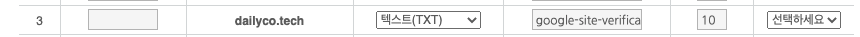
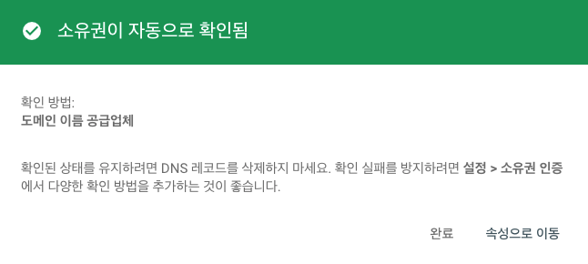
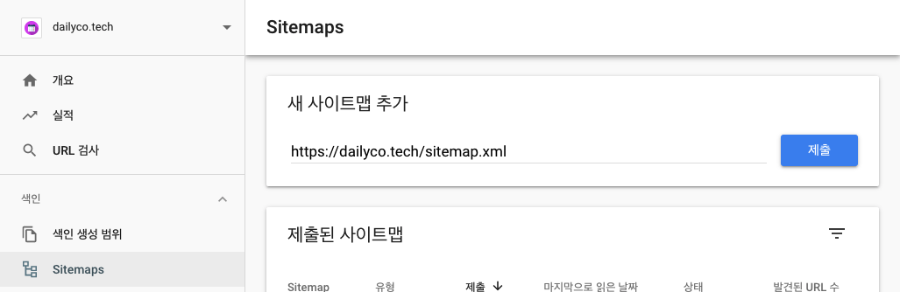
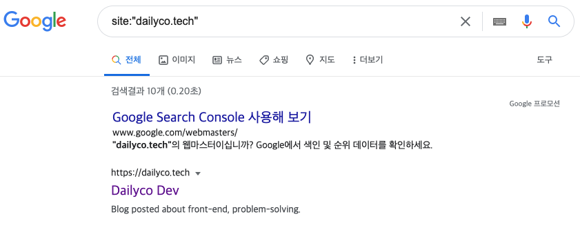
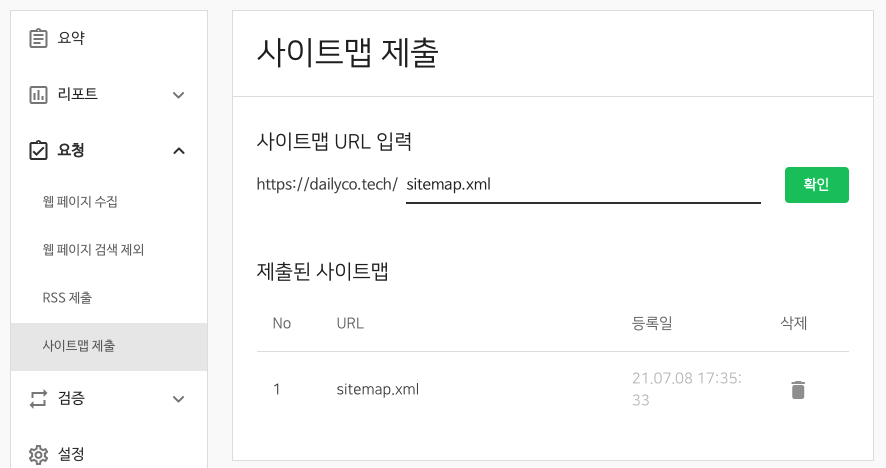
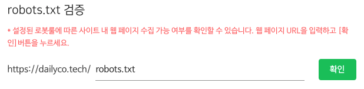
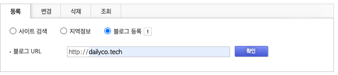

사람들이 블로그에 글을 적는 이유는 대부분 정리하여 기록하고 다른사람과 공유하기 위해서 일 것이다. 그럼 많은 사람들에게 내가 쓴 글을 보여주기 위해서는 어떻게해야할까? 내 블로그를 직접 찾아오는 사람들 뿐 아니라 검색을 통해서 유입되도록 해야한다. gatsby 블로그가 검색이 잘 되도록 SEO 작업을 해보자.
<br />
<br />

## SEO?

SEO를 처음 들어보는 사람도 있을것이다. Search Engine Optimization 의 약어로 검색 엔진 최적화를 의미한다. 웹 페이지 검색엔진이 자료를 수집하고 순위를 매기는 방식에 맞게 웹 페이지를 구성해서 검색 결과의 상위에 나올 수 있도록 하는 작업을 말한다.

간단하게 말하면, 브라우저마다 검색 엔진이 있는데 이 검색엔진에게 내 블로그에 어떤 글이 있는지 알려줘서, 사람들이 이와 관련한 정보를 검색할 때 내 블로그의 글을 노출시켜주도록 최적화 시켜주는 것이다. (물론 사람들이 맞는 정보라고 생각해 많이 찾아볼 수록 상위에 노출된다.)
<br />
<br />
<br />

## 구글 SEO 작업하기

먼저 구글에 내 블로그의 글이 잘 검색되게 하기 위해서는 웹 크롤러가 블로그를 찾아와 글을 크롤링할 수 있도록 이정표를 등록해야하는데, 이는 Google Search Console에 내 블로그를 등록한 후에 가능하다.

### Google Search Console 사이트 등록

[링크](https://search.google.com/search-console/about)에서 시작하기 버튼을 클릭해 속성을 등록한다.

속성을 등록할때 구매한 도메인을 DNS를 통해 등록하는 방법과 URL 접두어를 통해 등록하는 방법 두 가지가 있다. 도메인을 구매해서 블로그와 연결시켰을 경우 전자의 방법으로 해야하고, 도메인 없이 github이나 netlify로 배포했을 경우에는 후자의 방법으로 해야한다. 하나씩 알아보자.

#### DNS를 통해 도메인을 등록하는 방법

속성 유형 선택 창에서 `도메인` 속성을 선택해 구매한 도메인을 입력하고 `계속` 버튼을 누른다. DNS 레코드를 통해 도메인 소유권을 확인하는 창이 나올텐데, 깃헙에서 custom domain을 등록했을 때와 비슷하게 DNS 레코드를 추가해주어야한다.

나는 hosting.kr을 통해 도메인을 구매했기 때문에 hosting.kr 기준으로 설명하면, `나의 서비스 > 도메인 관리 > 나의 도메인 > DNS 설정` 메뉴에서 아래 부분에 `DNS 레코드 관리` 로 이동한다. 레코드 표 아래 '+' 버튼을 클릭해 DNS 레코드를 추가해준다. 만약 '+' 버튼이 비활성화 되어있다면 도메인이 잠금되어 있는것이니 풀어주고 DNS를 설정한 후 다시 잠그면 된다.

아래와 같이 레코드 타입을 텍스트(TXT)로 설정하고, GSC에서 제공한 값을 붙여넣는다.



정상적으로 등록된 후 GSC로 돌아와 `확인` 버튼을 누르면 아래와 같이 초록색 창이 뜬다.


<br />

#### URL 접두어를 통해 등록하는 방법

도메인 없이 github으로 배포했을 경우에는 `URL 접두어` 속성을 선택해 `https://${github-id}.github.io/${repository-name}` 을 입력한다. `계속` 버튼을 누르면 소유권을 확인하는 창이 나온다.

안내하는대로 제공하는 HTML 파일을 다운받고, 지정된 곳에 HTML 파일을 위치시킨다. `확인` 버튼을 누르면 올바른 위치에 HTML 파일이 읽히는지 확인하고, 정상적으로 읽히면 위와 마찬가지로 초록색 창이 뜬다.

하지만 지정한 위치에서 HTML 파일이 읽히기 위해서는 배포를 해야한다. 그런데 여기서 또 다시 문제가 발생한다. [이전 포스팅](https://dailyco.tech/share/gatsby-blog-auto-deploy)에서 커스텀 도메인을 연결시키고 배포를 진행할 때마다 초기화되는 문제와 비슷한것이다. HTML 파일이 root 디렉토리 아래에 존재하지만 배포는 build된 결과물을 담고있는 public 디렉토리를 기준으로 배포되기 때문에 HTML 파일이 없어진채로 배포가 되고, 해당 파일은 읽히지 않게된다. 이 문제를 해결하기 위해서 HTML 파일을 build 후에 public 디렉토리 아래로 복사시켜주는 과정이 필요하다.

Github Actions에서 배포할 때 HTML 파일을 복사시켜주는 과정을 추가하기위해 `main.yml` 파일을 아래와 같이 수정하자.

```yaml
name: gatsby deploy

on:
  push:
    branches: [main]

jobs:
  deploy:
    name: deploy
    runs-on: ubuntu-latest

    steps:
      - name: checkout code
        uses: actions/checkout@v2

      - name: packages install
        run: yarn install

      - name: gatsby build
        run: yarn build
        env:
          GH_API_KEY: ${{ secrets.API_KEY }}

      - name: copy files
        # ${{ HTML 파일 이름 }} 부분에 실제 google~~.html 파일 이름을 입력한다.
        run: |
          cp CNAME public/
          cp ${{ HTML 파일 이름 }} public/

      - name: deploy
        uses: maxheld83/ghpages@v0.2.1
        env:
          GITHUB_TOKEN: ${{ secrets.GITHUB_TOKEN }}
          GH_PAT: ${{ secrets.API_KEY }}
          BUILD_DIR: 'public/'
```

build와 deploy 과정 사이에 HTML 파일을 `public` 디렉토리에 복사하는 명령을 추가한 것이다. 이렇게하면 `public` 디렉토리 아래에 HTML 파일이 복사되어 함께 배포되기 때문에 문제가 해결된다.

로컬에서 `npm run deploy` 명령을 통해 배포할 때에도 deploy script를 아래와 같이 수정하여 이 문제를 해결할 수 있다.

```sh
"scripts": {
  # google~~.html 부분에 실제 HTML 파일 이름을 입력한다.
  "copy": "cp google~~.html public/"
  "deploy": "gatsby build && npm run copy && gh-pages -d public -b gh-pages"
}
```

`package.json` 파일의 script 부분을 위처럼 copy를 추가하고, deploy를 수정하면 된다. Github Actions과 마찬가지로 build하고 deploy하기 전에 HTML 파일을 `public` 디렉토리 아래에 복사하도록 한것이다. 만일 copy에 CNAME을 복사하는 명령이 있다면 간단하게 `&&`로 명령어를 연결시켜주면 된다.

위와 같이 수정해서 배포하면, HTML 파일을 읽어 정상적으로 등록될 것이다.

HTML 파일로 소유권을 확인하는 방법 외에도 HTML 태그나 구글 애널리틱스를 이용하는 등의 여러가지 방법이 있는데, 마찬가지로 안내하는대로만 진행하면 정상적으로 소유권 확인이 이루어질 것이다.
<br />
<br />

### gatsby-plugin-sitemap 설치

이전에 말했듯 웹 크롤러가 블로그를 찾아와 글을 크롤링할 수 있도록 이정표를 등록해야하는데, `sitemap.xml` 파일이 이정표 역할을 한다. 해당 파일을 만들어보자.

gatsby 블로그는 `sitemap.xml` 을 자동으로 생성해주는 `gatsby-plugin-sitemap` 플러그인이 있다. 이 플러그인을 설치하기 위해 아래 명령어를 입력해준다.

```sh
yarn add gatsby-plugin-sitemap

```

그리고 `gatsby-config.js` 파일의 `plugins` 부분에 아래와 같이 추가하면, build 될 때 `gatsby-plugin-sitemap` 플러그인이 `sitemap.xml` 파일을 생성하게된다.

```js
plugins: [
	...
	'gatsby-plugin-sitemap',
	...
]
```

`sitemap.xml` 이 제대로 생성되었는지 확인해보자.

```sh
gatsby develop
```

위 명령을 입력하고 "localhost:8000/sitemap.xml" 을 열어 페이지가 제대로 나오면 `sitemap.xml` 파일이 제대로 만들어진 것이다.
<br />
<br />

### sitemap.xml 제출하기

`sitemap.xml` 파일이 제대로 생성되었다면 이제 제출만하면 된다. 제출하기 전 배포를 진행해 `sitemap.xml` 파일도 함께 배포시키고, GSC에서 사이트맵을 제출해보자.

GSC에서 `Sitemaps` 메뉴로 이동하면 사이트맵을 추가할 수 있다. 아래와 사진과 같이 새 사이트맵 추가 영역에 `${처음에 속성을 등록할때 입력했던 도메인 또는 url}/sitemap.xml` 을 입력해 제출한다. sitemap.xml 파일의 이름을 변경했거나, 특정 디렉토리에 위치시켰다면 그것에 맞게 입력해주면 된다.


<br />
<br />

### 구글 검색창에 검색해보기

사이트맵이 정상적으로 잘 제출되고 크롤러가 크롤링해 검색엔진에 잘 올라가면, 구글 검색창에서 검색이 가능하다.

아래처럼 `site:"${도메인이름}"` 으로 검색하면 검색엔진에 등록된 사이트들은 검색 결과에 순서대로 노출된다.


<br />
<br />
<br />

## 네이버 SEO 작업하기

네이버도 구글과 비슷하다.  
구글에서 GSC를 제공하는 것처럼 Search Advisor (웹 마스터 도구)를 제공한다.

### Search Advisor 사이트 등록

GSC 와 마찬가지로 블로그 사이트를 등록해보자.  
[링크](https://searchadvisor.naver.com/console/board)에 접속해 자신의 도메인을 입력해 등록하면된다.

GSC에서 했던 것과 비슷하게 소유권 인증을 해야하는데, Search Advisor는 도메인을 구매해서 블로그와 연결시킨 경우와 도메인 없이 github이나 netlify로 배포했을 경우에 상관없이 같은 방법으로 인증한다.

인증 방법은 위의 [URL 접두어를 통해 등록하는 방법](#url-접두어를-통해-등록하는-방법)과 비슷하니 따라서 진행하면 된다.
<br />
<br />

### sitemap.xml 제출하기

블로그가 등록되면 `요청 > 사이트맵 제출` 메뉴로 이동해 사이트맵을 제출할 수 있다.  
아래 사진과 같이 입력한 후 `확인` 버튼을 클릭하면 사이트맵이 제출된다.



구글과 마찬가지로 sitemap.xml 파일의 이름을 변경했거나, 특정 디렉토리에 위치시켰다면 그것에 맞게 입력해주면 된다.
<br />
<br />

### gatsby-plugin-robots-txt 설치

[링크](https://searchadvisor.naver.com/tools/sitecheck) 에 들어가서 자신의 사이트 도메인을 입력해 체크해본다. `robots.txt` 항목이 등록되지 않아있을텐데, `robots.txt` 도 `sitemap.xml` 과 비슷하게 크롤러가 동작하기 위한 문서이기 때문에 작성해주는 것이 좋다.

gatsby 블로그는 `robots.txt` 도 자동으로 생성해주는 `gatsby-plugin-robots-txt` 플러그인이 있다. 설치해보자.

```sh
yarn add gatsby-plugin-robots-txt

```

그리고 `gatsby-config.js` 파일의 `plugins` 부분에 아래와 같이 추가하면, build 될 때 `gatsby-plugin-robots-txt` 플러그인이 `robots.txt` 파일을 생성하게된다.

```js
plugins: [
	...
	{
      resolve: 'gatsby-plugin-robots-txt',
      options: {
        // ${domain-url} 부분에 자신의 도메인 url을 넣는다
        host: '${domain-url}',
        sitemap: '${domain-url}/sitemap.xml',
        policy: [{
          userAgent: '*',
          allow: '/'
        }]
      }
    },
	...
]
```

build 후에 "localhost:8000/robots.txt" 를 확인해 `robots.txt` 이 제대로 생성되었는지 확인해보자.
<br />
<br />

### robots.txt 제출하기

`robots.txt` 파일이 제대로 생성되었다면 이제 제출만하면 된다. 제출하기 전 배포를 진행해 `robots.txt` 파일도 함께 배포시키고, Search Advisor에 검증 및 수집요청을 해보자.

Search Advisor에서 `검증 > robots.txt` 메뉴로 이동해 robots.txt 검증 부분에 아래와 같이 입력하고 검증받으면 된다. `robots.txt` 파일의 이름 또한 변경했거나, 특정 디렉토리에 위치시켰다면 그것에 맞게 입력해주면 된다.



검증을 받은후 `수집요청` 버튼을 클릭해 수집요청을 시작한다. 그리고 `설정` 메뉴로 이동해 수집 주기를 '빠르게'로 하고, 트래픽 제한 요청의 수집 제한량이 제한없음임을 확인한다.

설정을 마치면 네이버 SEO 작업은 끝이난다. 구글창에 검색했던 것처럼 `site:{블로그 도메인}`으로 검색해 사이트가 등록되었는지 확인가능하며, 구글과 다음과 비교했을 때 네이버가 제일 늦게 검색되었으니 여유롭게 기다리는 것을 추천한다.
<br />
<br />
<br />

## 다음 SEO 작업하기

다음은 웹사이트 정보를 직접 작성해 신청하는 방식이다. 그래서 엄청 간단하고 복잡한것도 없어서 딱히 설명할 것이 없다. [링크](https://register.search.daum.net/index.daum)에 들어가서 아래와 같이 블로그 등록을 선택해 URL을 입력하면 끝난다.


<br />
<br />
<br />

## 느낀점

구글과 네이버, 다음에 모두 등록한 후에 몇일 사용하면서 느낀점은 `다음 > 구글 > 네이버` 순으로 사이트 등록이 빠르다. 다음은 등록하자마자 거의 바로 검색이 가능했고, 구글은 등록 후에 1~3일 정도 걸린 것 같다. 새롭게 포스팅을 작성해서 배포한 후에도 1~2일 정도 걸린 후 페이지가 등록되는 듯 하다. 네이버는 등록한지 이제 일주일정도 됐는데, 아직도 등록되지 않았다. 얼른 등록되면 좋겠다.

그리고 Google Analytics에 블로그를 등록해 사람들의 블로그 유입을 확인하고 있는데, 이게 꽤나 재미있다. 많은 사람들이 내 블로그 글을 봤으면 하는 마음에 더 열심히 쓰게되기도 하고. Google Analytics에 등록하는 방법은 다음에 기회가 되면 포스팅하겠다. (사실 쉽고 간단해서 적을까말까 고민중이다.)
