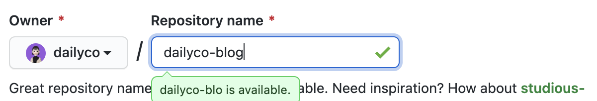

나는 블로그 유목민이다. 네이버 블로그를 시작으로 개발자라면 그래도 깃헙 블로그 하나쯤은 있어야지 싶어서 Jekyll 테마를 사용해 블로그를 만들고, 이제는 자주 사용하는 React 툴 기반으로 만들어진 Gatsby에 발을 들였다.
<br />
<br />

## 1. Gatsby 템플릿 선택하기

gatsby 블로그는 아예 밑바닥부터 시작해서 전부 만들어갈 수 있지만, 그렇게하면 시간이 너무 오래걸리기 때문에 나는 템플릿을 활용하기로 했다.

템플릿은 여러가지가 있는데 [`여기`](https://www.gatsbyjs.com/starters/?)를 참고하면 좋을 것 같다.  
나는 [`gatsby-starter-bee`](https://github.com/JaeYeopHan/gatsby-starter-bee) 템플릿을 사용했는데, 개인적으로 [`zoomkoding-gatsby-blog`](https://github.com/zoomKoding/zoomkoding-gatsby-blog) 템플릿도 무척 예쁘다고 생각한다. 내가 템플릿을 고를때 고려한 것들은 아래와 같다.

- 모바일뷰에서도 예쁘게 보이는가?
- 영어와 한글 폰트 모두 예쁜가?
- 보기에 깔끔하고 질리지 않을 디자인인가?
- 기본적인 편의 기능을 갖추고 있는가? (다크모드, 페이징 등)
- 이미 완성된 디자인이 아닌 내가 원하는대로 커스터마이징하기 편한 구조인가?
  <br />
  <br />

[`gatsby-starter-bee`](https://github.com/JaeYeopHan/gatsby-starter-bee) 템플릿은 위의 것들을 생각하면 사실 조금 부족한 부분들이 있었다. 개인적으로 기본적인 편의 기능이라고 생각하는 검색 기능과 목차(toc) 기능이 없었기 때문이다.  
하지만 사람들이 많이 사용하기도하고, 나머지 것들은 전체적으로 마음에 들었기 때문에 해당 템플릿을 선택했다.
<br />
<br />
<br />

## 2. 템플릿 설치하기

사용할 템플릿을 골랐다면 해당 템플릿을 설치해야한다.

### 템플릿 설치

```sh
# npx 사용
npx gatsby new ${디렉토리 이름} ${템플릿 깃헙 주소}

# ex. npx gatsby new my-blog https://github.com/JaeYeopHan/gatsby-starter-bee

```

```sh
# npx 사용 X
npm install -g gatsby-cli
gatsby new ${디렉토리 이름} ${템플릿 깃헙 주소}

# ex. gatsby new my-blog https://github.com/JaeYeopHan/gatsby-starter-bee
```

<br />

### developing

```sh
cd ${디렉토리 이름}
npm start
# localhost:8000 을 열어 블로그 확인
```

<br />
<br />

## 3. Repository 생성 & 연결

코드 관리를 위해 깃헙 레포지토리를 생성해 연결시켜주어야 한다.



레포지토리의 이름은 자유롭게해도 상관없는데, 따로 구매한 도메인을 사용하지 않고 깃헙 페이지로 배포를 원한다면 레포지토리의 이름을 반드시 `${github-id}.github.io`로 해야한다. 구매한 도메인을 사용할 예정이라면 레포지토리의 이름을 자유롭게해도 문제가 없다. 배포 부분은 다음글에서 더욱 자세하게 다루겠다.

<br />

이렇게 레포지토리를 생성하고, 이전에 설치한 블로그 템플릿을 레포지토리에 연결시켜준다.

```sh
cd ${디렉토리 이름}
git init
git add .
git commit -m ${commit_message}
git branch -M main
git remote add origin ${repository_url}.git
git push -u origin main
```

이렇게하면 이제 레포지토리와 생성한 블로그가 연결되어 코드를 편하게 관리할 수 있게 되었다.
